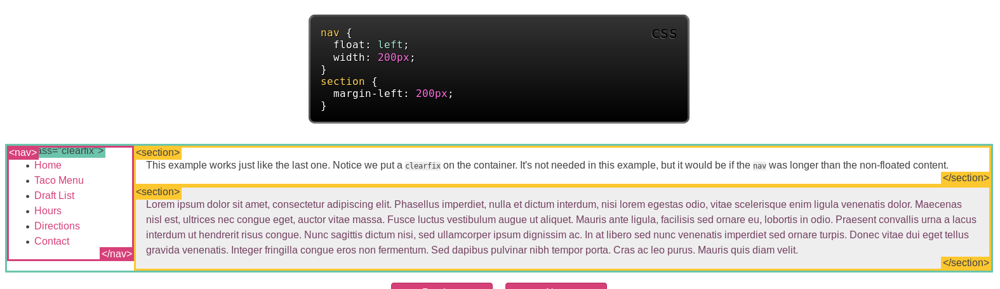

<div dir=rtl>بنام خدا</div>

##### top

- [Layout](#layout)


[top](#top)
### Layout
I summarized [this](http://learnlayout.com/no-layout.html) article.
if there is no layout, every things come consective(line long as much as it can)
- display:
  1. every object has itself display.
     1. __block__ as default for _div,p,form,header,footer,section_ .Start  On New line and stratches from left to right.
        - set _width_ to Number and _margine_ to auto make it centeral and prevent of streches.
        - in above set _max-width_ will beter handle small window.
        - _-webkit-box-sizing,-moz-box-sizing,box-sizing: border-box;_ make object no longer than its width.
     2. __inline__ as default for _span,a_ can wrap things inside a object like _p_ wihtout disrupting it.
     3. __none__ as default for __script__, that wouldn't come on page rendereing
  2. position:
     1. __static__ is default Position and object would't reposition any change of window or scroll
     2. __relative__ means realtive to _top,left,right,bottom_ properties those you define, without __relative__ you wouldn't give response from those properties
    
     3. __fixed__ , fix Object from scroll in viewport, it need position properties
     4. __absolute__ same as _fixed_ but inside the its parent Object
  
[top](#top)
  3. float: useful for wrap text around a image: <p ...>  Text ...</p>
  
  4. clear: useful to prevent overlapping of floating Objects.
  
  
[top](#top)
  5. clearfix: may an Object contain an another Object that may has height or width greather than itself, __overflow:auto__ make parents growth as much as its child
  
  
[top](#top)
  6. doing some positiong with _float_ instead of _position_. __position:relative__ is needed as default
  
  
[top](#top)
  7. What shall we do if would like to have well show on some kind of device?. the __media__ property is for this.
     - Syntax is
     ```
       @media not|only mediatype and (media feature) {
         CSS-Code;
       }
     ```
     - __Media Types__ are:

      Value|Description
      ---|---
      all|Used for all media type devices
      print|Used for printers
      screen|Used for computer screens, tablets, smart-phones etc.
      speech|Used for screenreaders that "reads" the page out loud
     - And __Media Features__ are:
     
      Value|Description
      ---|---
      any-hover|Does any available input mechanism allow the user to hover over elements? (added in Media Queries Level 4)
      any-pointer|Is any available input mechanism a pointing device, and if so, how accurate is it? (added in Media Queries Level 4)
      aspect-ratio|The ratio between the width and the height of the viewport
      color|The number of bits per color component for the output device
      color-index|The number of colors the device can display
      grid|Whether the device is a grid or bitmap
      height|The viewport height
      hover|Does the primary input mechanism allow the user to hover over elements? (added in Media Queries Level 4)
      inverted-colors|Is the browser or underlying OS inverting colors? (added in Media Queries Level 4)
      light-level|Current ambient light level (added in Media Queries Level 4)
      max-aspect-ratio|The maximum ratio between the width and the height of the display area
      max-color|The maximum number of bits per color component for the output device
      max-color-index|The maximum number of colors the device can display
      max-device-aspect-ratio|The maximum ratio between the width and the height of the device
      max-device-height|The maximum height of the device, such as a computer screen
      max-device-width|The maximum width of the device, such as a computer screen
      max-height|The maximum height of the display area, such as a browser window
      max-monochrome|The maximum number of bits per "color" on a monochrome (greyscale) device
      max-resolution|The maximum resolution of the device, using dpi or dpcm
      max-width|The maximum width of the display area, such as a browser window
      min-aspect-ratio|The minimum ratio between the width and the height of the display area
      min-color|The minimum number of bits per color component for the output device
      min-color-index|The minimum number of colors the device can display
      min-device-aspect-ratio|The minimum ratio between the width and the height of the device
      min-device-width|The minimum width of the device, such as a computer screen
      min-device-height|The minimum height of the device, such as a computer screen
      min-height|The minimum height of the display area, such as a browser window
      min-monochrome|The minimum number of bits per "color" on a monochrome (greyscale) device
      min-resolution|The minimum resolution of the device, using dpi or dpcm
      min-width|The minimum width of the display area, such as a browser window
      monochrome|The number of bits per "color" on a monochrome (greyscale) device
      orientation|The orientation of the viewport (landscape or portrait mode)
      overflow-block|How does the output device handle content that overflows the viewport along the block axis (added in Media Queries Level 4)
      overflow-inline|Can content that overflows the viewport along the inline axis be scrolled (added in Media Queries Level 4)
      pointer|Is the primary input mechanism a pointing device, and if so, how accurate is it? (added in Media Queries Level 4)
      resolution|The resolution of the output device, using dpi or dpcm
      scan|The scanning process of the output device
      scripting|Is scripting (e.g. JavaScript) available? (added in Media Queries Level 4)
      update-frequency|How quickly can the output device modify the appearance of the content (added in Media Queries Level 4)
      width|The viewport width
     - the example
     
     

     
  
  
[top](#top)
